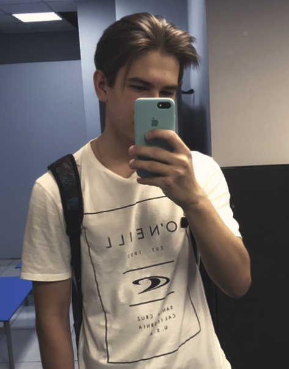

## Это моя страница на Github

#### Здесь вы сможете узнать некоторую информацию обо мне

Меня зовут Владислав, я родился в Пермском крае, в городе Березники в 2001 году. Я окончил физмат и поступил в РГПУ им. Герцена по направлению ИВТ. Я создал страницу на Github, чтобы поделиться своими работами. Я люблю музыку, активный образ жизни и IT индустрию.

Из языков программирования я пока что знаю только Pascal.

[Страничка VK](https://vk.com/rizzan18)

[Telegram](https://t.me/rizzan18)
